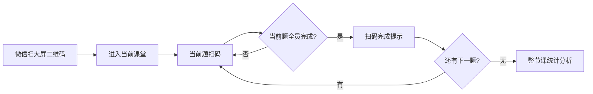
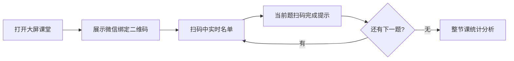

# 课堂大屏与微信扫码端实时联动方案

## 已确认需求

1. 从大屏开始课堂  
   大屏首先展示一个二维码。老师用微信扫码后，微信浏览器打开移动端，并自动绑定当前课堂。

2. 二维码要一直保留  
   老师微信退出后，重新扫码仍然能进入同一个课堂继续工作。

3. 移动端外网地址暂定  
   微信浏览器访问移动端时使用：

   ```text
   https://zhida.cpolar.top
   ```

   二维码地址在此基础上追加课堂参数。

4. 当前题全员扫码完成后自动推进  
   如果当前题全部学生都完成扫码，大屏提示“扫码完成，请大家放下码”，然后系统自动进入下一题。

5. 全部题目完成后自动进入统计分析  
   如果所有题目都完成扫码，手机端和大屏端都进入整节课统计分析页面。

## 核心思路

课堂 `session` 是唯一同步中心。大屏、手机端都不单独决定当前题，而是读取后端的课堂实时状态：

- 当前阶段是什么。
- 当前题是哪一题。
- 当前题已答、未答、答错是谁。
- 是否已经全部完成。
- 是否进入整节课报告。

手机端负责扫码和上传答案；后端负责判断是否全员完成、是否自动进入下一题；大屏只负责订阅并展示。

## 课堂状态设计

### Session 增加字段

```ts
type SessionStage =
  | 'binding'
  | 'scanning'
  | 'question_complete'
  | 'question_result'
  | 'session_report';

interface Session {
  id: string;
  classroomCode: string;
  status: 'draft' | 'active' | 'ended';
  stage: SessionStage;
  currentQuestionId: string;
  currentQuestionIndex: number;
  questionIds: string[];
  classId: string;
  teacherName?: string;
  updatedAt: string;
  autoAdvanceAt?: string;
}
```

### 阶段含义

- `binding`：大屏展示微信扫码绑定二维码。
- `scanning`：当前题扫码中，大屏实时显示已扫/未扫名单。
- `question_complete`：当前题全员完成，大屏显示“扫码完成，请大家放下码”。
- `question_result`：手动查看当前题分析，后续保留给老师暂停讲评使用。
- `session_report`：全部题完成，手机和大屏都进入整节课报告。

## 大屏绑定二维码

### 二维码内容

```text
https://zhida.cpolar.top/?sessionId=xxx&classroomCode=xxx
```

如果要进入学生测试码页：

```text
https://zhida.cpolar.top/?testCodes&sessionId=xxx&classroomCode=xxx
```

### 大屏展示策略

- 大屏主区域展示课堂状态。
- 页面右上角或侧栏一直保留“教师微信扫码继续控制”的二维码。
- 二维码绑定当前 `sessionId`，所以老师退出微信后重新扫码仍然回到同一个课堂。
- 没有 `sessionId` 或 `classroomCode` 时，大屏显示“等待绑定课堂”，不再展示演示数据。

## 新增 / 调整接口

### 1. 获取课堂实时状态

```http
GET /api/sessions/:sessionId/live-state?showRealNames=true
```

返回：

```ts
interface SessionLiveState {
  session: SessionDetailView;
  stage: SessionStage;
  currentQuestion: QuestionView;
  stats: QuestionStatsView;
  participants: QuestionParticipantView[];
  mobileBindUrl: string;
  autoAdvanceAt?: string;
  report?: SessionReportView;
  diagnosis?: AiDiagnosisResult;
}
```

手机端和大屏端都使用这个接口，避免各自拼多个接口产生不同步。

### 2. 获取绑定二维码信息

```http
GET /api/sessions/:sessionId/binding
```

返回：

```ts
{
  sessionId: string;
  classroomCode: string;
  mobileBindUrl: string;
}
```

### 3. 更新课堂阶段

```http
POST /api/sessions/:sessionId/stage
```

请求：

```ts
{
  stage: 'binding' | 'scanning' | 'question_result' | 'session_report';
  questionId?: string;
}
```

用途：

- 大屏创建课堂后：进入 `binding`。
- 微信扫码进入移动端并开始扫码：进入 `scanning`。
- 老师手动暂停讲评：进入 `question_result`。
- 老师手动结束课堂：进入 `session_report`。

### 4. 答案上传后自动推进

现有上传接口：

```http
POST /api/sessions/:sessionId/answers/batch
```

需要增加后端自动判断：

1. 保存本批答案。
2. 统计当前题 `answered` 和 `total`。
3. 如果 `answered < total`，保持 `scanning`。
4. 如果 `answered === total`，进入 `question_complete`，设置 `autoAdvanceAt = now + 3s`。
5. 到达 `autoAdvanceAt` 后：
   - 如果还有下一题，切换 `currentQuestionId`，进入 `scanning`。
   - 如果没有下一题，进入 `session_report`。

MVP 可以不用后台定时任务，而是在 `live-state` 被大屏轮询时检查 `autoAdvanceAt` 并完成推进。

### 5. 通过课堂码恢复课堂

```http
GET /api/sessions/by-code/:classroomCode
```

用于大屏或微信端通过短码恢复课堂，支持多个课堂同时使用。

## 手机端流程



### 手机端行为

- 打开 URL 后读取 `sessionId`。
- 自动加载 `live-state`。
- 当前阶段为 `scanning` 时，显示摄像头扫码。
- 当前阶段为 `question_complete` 时，显示当前题已完成，等待进入下一题。
- 当前阶段为 `session_report` 时，显示整节课报告。
- 微信退出后重新扫码，因为 URL 仍带 `sessionId`，可以恢复同一课堂。

## 大屏端流程



### 大屏根据 stage 自动切换

```ts
if (stage === 'binding') {
  showBindingQr();
}
if (stage === 'scanning') {
  showLiveScanningView();
}
if (stage === 'question_complete') {
  showQuestionCompleteView();
}
if (stage === 'question_result') {
  showQuestionAnalysisView();
}
if (stage === 'session_report') {
  showSessionReportView();
}
```

## 多课堂同时使用

### 绑定规则

- 每个课堂一个唯一 `sessionId`。
- 每个未结束课堂一个唯一 `classroomCode`。
- 大屏二维码必须带当前课堂的 `sessionId`。
- 手机端上传答案必须带当前课堂的 `sessionId`。
- 大屏轮询必须带当前课堂的 `sessionId`。

### 防串课规则

- 后端不接受没有 `sessionId` 的答案上传。
- 一个大屏只展示一个 `sessionId` 的 live-state。
- 微信端重新扫码只恢复二维码里的那个课堂。
- 课堂结束后默认不再接受答案，除非教师手动重新开启。

## 轮询策略

MVP 先用轮询，不上 WebSocket：

- 大屏每 1 秒请求一次 `live-state`，保证自动推进及时。
- 手机端上传答案后立即刷新一次 `live-state`。
- 手机端每 2 秒轻量轮询一次，感知自动进入下一题或报告页。

后续如并发课堂多，再升级为 SSE / WebSocket。

## 开发顺序建议

1. 后端补 `SessionStage`、`currentQuestionId`、`autoAdvanceAt`。
2. 后端补 `live-state` 和 `binding` 接口。
3. 后端在答案上传后增加“全员完成自动推进”逻辑。
4. 大屏端移除默认演示主流程，改为绑定二维码 + live-state 驱动。
5. 手机端支持从 URL 读取 `sessionId`，直接恢复课堂。
6. 手机端和大屏端都按 `stage` 自动切换页面。
7. 最后补课堂码恢复和多课堂边界测试。

## MVP 先做

- 大屏展示微信绑定二维码。
- 二维码使用 `https://zhida.cpolar.top` 并追加课堂参数。
- 大屏和手机都用 `sessionId` 绑定同一课堂。
- 当前题全员完成后自动进入下一题。
- 全部题完成后自动进入整节课统计分析。

## 暂缓

- 手动上一题补扫。
- 课堂结束后重新开启。
- WebSocket / SSE。
- 多教师权限控制。
