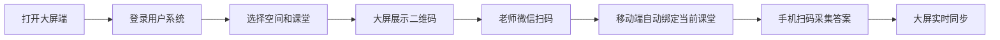

# 智答课堂用户系统开发方案

## 目标整理

智答课堂需要从当前的演示/单机课堂工具，升级为多用户管理平台。核心目标：

- 用户可以用邮箱注册和登录。
- 登录后进入后台管理班级、学生、科目、题库、课堂记录。
- 不同用户的数据相互隔离。
- 支持个人用户和学校账户两种组织形态。
- 大屏端打开后先登录，登录后展示绑定二维码，手机扫码后自动绑定当前登录用户和课堂，不需要手机端再单独登录。
- 学校账户可以管理成员，成员之间可以共享学校下的班级、学生、题库等数据。

## 账户模型

## 用户 User

用户是系统登录身份。

```ts
interface User {
  id: string;
  email: string;
  passwordHash: string;
  displayName: string;
  phone?: string;
  status: 'active' | 'disabled';
  createdAt: string;
}
```

邮箱是第一版登录账号。手机号暂时作为资料字段，不作为必填登录方式。

## 空间 Workspace

所有业务数据不直接挂在用户上，而是挂在一个空间下。这样才能同时支持个人用户和学校账户。

```ts
interface Workspace {
  id: string;
  type: 'personal' | 'school';
  name: string;
  schoolName?: string;
  ownerUserId: string;
  createdAt: string;
}
```

个人用户注册后，系统自动创建一个个人空间。  
学校账户创建后，系统创建一个学校空间。

## 成员 WorkspaceMember

用户和空间之间通过成员关系连接。

```ts
interface WorkspaceMember {
  id: string;
  workspaceId: string;
  userId: string;
  role: 'owner' | 'admin' | 'teacher';
  subject?: string;
  phone?: string;
  email?: string;
  status: 'active' | 'invited' | 'disabled';
}
```

角色含义：

- `owner`：空间所有者，可以管理学校资料、成员、全部数据。
- `admin`：学校管理员，可以管理成员、班级、学生、题库。
- `teacher`：教师成员，可以使用被授权或共享的班级、题库。

## 个人资料

个人用户需要维护：

- 姓名
- 学校
- 教学科目
- 联系电话
- 邮箱

学校账户需要维护：

- 学校名称
- 学校联系人
- 联系电话
- 成员列表
- 成员邮箱/手机号

## 数据归属设计

当前班级、学生、题目、课堂活动都需要增加 `workspaceId`。

```ts
interface Class {
  id: string;
  workspaceId: string;
  name: string;
  grade: string;
}

interface Student {
  id: string;
  workspaceId: string;
  classId: string;
  name: string;
  cardCode: string;
}

interface Question {
  id: string;
  workspaceId: string;
  creatorUserId: string;
  subject: string;
  stem: string;
}

interface Session {
  id: string;
  workspaceId: string;
  teacherUserId: string;
  classId: string;
}
```

后端所有查询都必须带当前用户的 `workspaceId` 过滤，避免不同用户看到彼此数据。

## 登录与权限流程

## 邮箱注册

第一版：

```text
填写邮箱 + 密码 + 姓名
      ↓
创建 User
      ↓
创建个人 Workspace
      ↓
创建 WorkspaceMember(owner)
      ↓
登录进入后台
```

后续可以增加邮箱验证码。MVP 阶段可以先做邮箱格式校验和密码加密。

## 邮箱登录

```text
邮箱 + 密码
  ↓
后端校验 passwordHash
  ↓
签发登录 token / session cookie
  ↓
前端进入后台
```

建议第一版用 HttpOnly Cookie 保存登录态，浏览器后台和大屏都可以自然复用。

## 空间切换

如果一个用户既有个人空间，又加入了学校空间，后台顶部需要提供空间切换：

```text
当前空间：个人工作台 / 某某学校
```

切换空间后，班级、学生、题库、课堂记录都按当前空间展示。

## 大屏登录绑定流程

你提出的新流程非常关键，建议这样设计：



关键点：

- 大屏端必须先登录。
- 大屏登录后选择当前用户/学校空间下的班级、题目，创建课堂。
- 大屏生成二维码，二维码携带 `sessionId` 和一次性 `bindToken`。
- 手机微信扫码后，不需要登录，只要 `bindToken` 有效，就能进入当前课堂扫码。
- 手机端只能操作这个课堂，不能访问后台管理功能。

## 为什么手机端不用再次登录

手机扫码 URL 可以是：

```text
https://780d4133.r30.cpolar.top/mobile-bind?sessionId=xxx&bindToken=yyy
```

后端校验：

- `sessionId` 是否存在。
- `bindToken` 是否有效。
- 课堂是否属于大屏当前登录用户/空间。
- token 是否过期或被撤销。

通过后，手机端拿到一个“课堂扫码权限”，只允许：

- 获取当前课堂 live-state。
- 上传当前课堂答案。
- 查看当前课堂分析。

不允许：

- 管理班级。
- 管理学生。
- 管理题库。
- 查看其他课堂。

这样就满足“手机不用登录 App/账号”，同时安全边界也清楚。

## 学校账户与共享

学校账户本质是 `workspace.type = school`。

学校管理员可以：

- 设置学校名称。
- 邀请成员。
- 停用成员。
- 管理学校下的班级、学生、题库。

成员可以用邮箱注册/登录后加入学校空间。

第一版成员邀请可以简化为：

```text
管理员录入成员邮箱
      ↓
系统创建 invited 记录
      ↓
成员用该邮箱注册/登录
      ↓
自动加入学校空间
```

手机号可以先作为成员资料字段，不建议第一版做短信登录，成本和复杂度都更高。

## 后台页面规划

登录前：

- 登录页
- 注册页

登录后：

- 工作台首页
- 个人资料设置
- 空间/学校设置
- 成员管理
- 班级管理
- 学生管理
- 科目管理
- 题库管理
- 课堂活动
- 课堂报告

其中你当前已经有：

- 班级管理
- 学生导入
- 题库管理
- 大屏入口
- 移动扫码端

后续要把这些页面接入用户和空间权限。

## 后端模块规划

新增模块：

- `auth`：注册、登录、退出、当前用户。
- `users`：用户资料。
- `workspaces`：个人空间、学校空间、空间切换。
- `members`：学校成员管理。
- `subjects`：科目管理。

调整现有模块：

- `classes` 增加 `workspaceId`。
- `students` 增加 `workspaceId`。
- `questions` 增加 `workspaceId`、`creatorUserId`。
- `sessions` 增加 `workspaceId`、`teacherUserId`。
- `answers` 通过 `session.workspaceId` 间接校验权限。
- `reports` 通过 `session.workspaceId` 校验权限。

## 数据库表建议

新增：

- `users`
- `workspaces`
- `workspace_members`
- `subjects`
- `mobile_bind_tokens`

调整：

- `classes` 添加 `workspace_id`
- `students` 添加 `workspace_id`
- `questions` 添加 `workspace_id`, `creator_user_id`
- `sessions` 添加 `workspace_id`, `teacher_user_id`

## 开发阶段建议

### 第一阶段：邮箱登录 + 个人空间

目标：先让每个用户看到自己的数据。

- 注册/登录/退出。
- 当前用户接口 `/api/auth/me`。
- 自动创建个人空间。
- 班级、学生、题库、课堂按 `workspaceId` 隔离。
- 教师后台登录后才能访问。

### 第二阶段：大屏登录 + 手机免登录绑定

目标：大屏登录后，微信扫码直接进入移动端。

- 大屏登录态复用用户系统。
- 创建课堂时生成 `bindToken`。
- 大屏二维码携带 `sessionId + bindToken`。
- 手机端通过 token 绑定课堂。
- 手机端不需要用户账号。

### 第三阶段：学校账户 + 成员管理

目标：学校空间和成员共享数据。

- 创建学校空间。
- 学校资料设置。
- 成员邀请。
- 成员角色。
- 学校空间下共享班级、学生、题库。

### 第四阶段：权限细化

目标：更细的学校管理能力。

- 班级负责人。
- 题库私有/校内共享。
- 成员停用。
- 操作日志。
- 历史报告归档。

## 关键产品决策

建议第一版不要做手机号登录。

原因：

- 邮箱注册更容易实现。
- 学校成员邀请也天然适合邮箱。
- 手机号涉及短信服务、费用、风控、验证码安全。
- 手机端扫码不需要登录，只需要课堂绑定 token。

手机号可以作为资料字段和后续找回账号方式。

## 推荐第一版范围

第一版就做：

- 邮箱注册登录。
- 个人空间。
- 数据按空间隔离。
- 后台管理班级、学生、科目、题库。
- 大屏登录后生成课堂二维码。
- 手机微信扫码免登录进入课堂。

暂时不做：

- 短信验证码。
- 微信 OAuth 登录。
- 复杂学校审批流。
- 多校区组织架构。
- 精细到单班级授权。

## 开发记录

### 2026-05-19 第一阶段已完成

- 后端新增 `auth` 模块，支持邮箱注册、登录、退出、当前用户接口。
- 注册后自动创建个人空间，并建立 `owner` 成员关系。
- 登录态使用 HttpOnly Cookie，同时兼容 Bearer Token。
- 教师后台增加登录/注册入口，未登录时不进入管理台。
- 班级、学生、题库、课堂已接入 `workspaceId`，列表和新增按当前空间隔离。
- 数据库迁移已补充 `users`、`workspaces`、`workspace_members`、`auth_sessions`。
- 已通过后端测试、教师端构建、大屏端构建、移动扫码端构建和结构检查。

### 第二阶段待开发

- 大屏登录后生成带 `sessionId + bindToken` 的二维码。
- 手机微信扫码后用 `bindToken` 获取单节课堂扫码权限，不要求手机端再次登录。
- 移动端权限限定在当前课堂的 live-state、答案上传和分析页。
